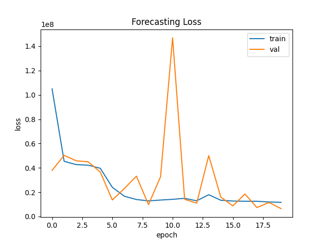

# 光伏功率预测

fork https://github.com/irutheu/LSTM-power-forecasting.git 仓库。
仓库中使用LSTM模型进行预测。

## 要求

研制基于深度学习的光伏功率预测工具，满足：

- 具备短期光伏功率预测功能；
- 能够基于历史和当前气象数据动态调整预测结果；
- 能够针对不同地区和类型的光伏电站进行模型微调，显著提高实际应用中的预测精度与可靠性。

## 数据说明

| 数据名称             | 输入/标签 | 说明 | 与dc_power的Pearson相关系数 |
| :-----------------: | :------: | :-: | :-----------------------: |
| ac_current          |  |  | - |
| ac_power            |  |  | - |
| ac_voltage          |  |  | - |
| ambient_temp        | 输入 | 环境温度 | 0.415954619 |
| dc_current          |  |  | - |
| dc_power            | 标签 | 直流功率 | 1 |
| dc_voltage          |  |  | - |
| inverter_error_code |  |  | - |
| inverter_temp       | 输入 | 逆变器温度 | 0.633105788 |
| module_temp         | 输入 | 模块温度 | 0.721930821 |
| poa_irradiance      | 输入 | 阵列面辐照度 | 0.980303532 |
| power_factor        |  |  | - |
| relative_humidity   | 输入 | 相对湿度 | -0.405921067 |
| wind_direction      | 输入 | 风向 | -0.027344522 |
| wind_speed          | 输入 | 风速 | 0.214515646 |

## 实验结果

使用 2012-2014 年 hourly 的光伏功率数据，训练 20 个 epochs 后的结果。

| 序号 | 模型             | optimizer | 训练效果 | rmse | mae | 预测曲线图 |
| :-: | :--------------: | :-------: | :-----: | :-: | :-: | :-------: |
| baseline |  | Adam | 7760534.0645 | 3646 | 2060 |  |
| 1 |  | AdamW | 5225995.5000 | 3148.1853 | 1795.4615 |  |
| 2 |  | AdamW |  | 4082.8988 | 3409.0554 |  |
| 3 |  | AdamW |  | 3370.2672 | 1834.6124 |  |
| 4 |  | AdamW |  | 3598.4814 | 1883.6083 |  |
| 5 |  | AdamW |  | 3389.9635 | 1824.6341 |  |
| 6 |  | AdamW |  | 3088.3614 | 1506.0205 |  |
| 7 |  | AdamW |  | 3227.9855 | 1808.1091 |  |
